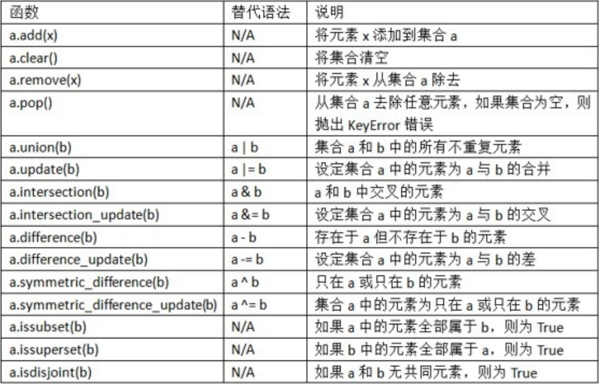
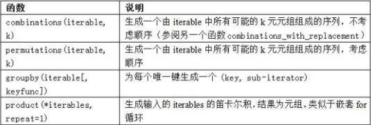
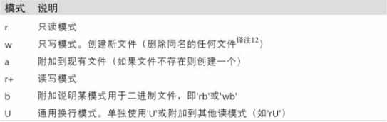
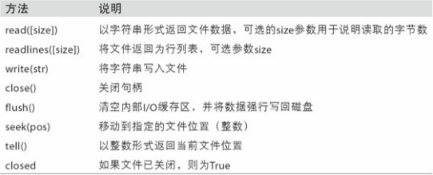

[toc]
Python最基础的数据结构：元组、列表、字典和集合
## 3.1 数据结构和列表
### 元组：固定长度，不可改变的Python序列对象
+ 元组中存储的对象可能是可变对象 
  + 一旦创建了元组，元组中的对象就不能修改了
  + 如果元组中的某个对象是可变的，比如列表，可以在原位进行修改
  + 元组乘以一个整数，像列表一样，会将几个元组的复制串联起来，对象本身并没有复制，只是引用了它
#### 拆分元组
#### tuple方法
### 列表
与元组对比，列表的长度可变、内容可以被修改
#### 添加和删除元素
+ 添加
  + append：添加至列表末尾
  + insert：添加至指定位置
+ 删除
  + pop：删除列表末尾元素
  + remove：删除指定位置元素
+ 检查
  + in：检查列表是否包含某个值
  + not in：检查列表是否**不**包含某个值
**在列表中检查是否存在某个值*远*比字典和集合速度慢，因为Python是线性搜索列表的值**
#### 串联和组合列表
+ 串联
```python
[4, None, 'foo'] + [7, 8, (2, 3)]
>>> [4, None, 'foo', 7, 8, (2, 3)]
```
+ 追加
```python
x = [4, None, 'foo']
x.extend([7, 8, (2, 3)])
>>> [4, None, 'foo', 7, 8, (2, 3)]
```
+ append与extend区别
```python
x = [4, None, 'foo']
x.append([7, 8, (2, 3)])
>>> [4, None, 'foo', [7, 8, (2, 3)]]
```
#### 排序
使用sort函数将一个列表原地排序（**不创建新的对象**）
```python
a = [7, 2, 5, 1, 3]
a.sort()
>>> [1, 2, 3, 5, 7]
b = ['saw', 'small', 'He', 'foxes', 'six']
b.sort(key=len)
>>> ['He', 'saw', 'six', 'small', 'foxes']
```
#### 二分搜索和维护已排序的列表
bisect模块支持二分查找，和向已排序的列表插入值
+ bisect.bisect可以找到插入值后仍保证排序的位置
+ bisect.insort是向这个位置插入值
#### 切片
+ 切片包含起始元素，不包含结束元素
+ 负数表明从后向前切片
+ 第二个冒号后面的step表示切片步长
#### 序列函数
+ enumerate函数：返回（i,value）元组序列
+ sorted函数：从任意序列的元素返回一个新的排好序的列表
  + sorted函数可以接受和sort相同的参数
+ zip函数：将多个列表、元组或其他序列成对组合成一个元组列表
  + 可以处理任意多的序列，元素的个数取决于最短的序列
  + 同时迭代多个序列，可结合enumerate使用
  + 给出⼀个“被压缩的”序列，zip可以被⽤来解压序列。也可以当作把⾏的列表转换为列的列表。
```python
seq1 = ['foo', 'bar', 'baz']
seq2 = ['one', 'two', 'three']
zipped = zip(seq1, seq2)
list(zipped)
>>> [('foo', 'one'), ('bar', 'two'), ('baz', 'three')]
seq3 = [False, True]
list(zip(seq1, seq2, seq3))
>>> [('foo', 'one', False), ('bar', 'two', True)]
for i, (a, b) in enumerate(zip(seq1, seq2)):
    print('{0}: {1}, {2}'.format(i, a, b))
>>> 0: foo, one
    1: bar, two
    2: baz, three
pitchers = [('Nolan', 'Ryan'), ('Roger', 'Clemens'), ('Schilling', 'Curt')]
first_names, last_names = zip(*pitchers)
first_names, last_names
>>> (('Nolan', 'Roger', 'Schilling'), ('Ryan', 'Clemens', 'Curt'))
```
+ reversed函数
  + reversed是一个生成器，只有实例化（即列表或for循环）之后才能创建翻转的序列
### 字典
使用del关键字或pop方法（返回值的同时删除键）删除值
keys和values是字典键和值的迭代器方法。虽然键值对没有顺序，但可以用相同的顺序输出键和值
用update方法可以将一个字典和另一个融合
```python
# update方法是原地改变字典，任何传递给update的键的旧的值都会被舍弃
d1 = {'a': 'some value', 'b': [1, 2, 3, 4], 7: 'an integer'}
d1.update({'b': 'foo', 'c': 12})
d1
>>> {'a': 'some value', 'b': 'foo', 7: 'an integer', 'c': 12}
```
#### 用序列创建字典
```python
mapping = {}
for key, value in zip(key_list, value_list):
    mapping[key] = value
# 字典本质上是2元元组的集合，dict可以接受2元元组的列表
mapping = dict(zip(range(5), reversed(range(5))))
mapping
>>> {0: 4, 1: 3, 2: 2, 3: 1, 4: 0}
```
#### 默认值
+ setdefault
+ defaultdict
#### 有效的键类型
+ 字典的值可以是任意Python对象，而键通常是不可变的标量类型（整数、浮点数、字符串）或元组（元组中的对象必须是不可变的），这被称为‘可哈希性’。
+ 可以用hash函数检测一个对象是否是可哈希的（可被用作字典的键）
+ 要用列表当做键，是将列表转化为元组，只要内部元素可以被哈希，它也就可以被哈希
### 集合
集合是无序的不可重复的元素的集合。可以将它当做字典，但是只有键没有值
+ 集合支持合并、交集、差分和对称差等数学集合运算
```python
a = {1, 2, 3, 4, 5}
b = {3, 4, 5, 6, 7, 8}
# 合并
a.union(b)
a | b
>>> {1, 2, 3, 4, 5, 6, 7, 8}
# 交集
a.intersection(b)
a & b
>>> {3, 4, 5}
```
常用的集合方法

+ 所有逻辑集合操作都有另外原地实现方法，可以直接用结果替代集合的内容
+ 与字典类似，集合元素通常都是不可变的。要获得类似列表的元素，必须转换成元组
### 列表、集合和字典推导式
形式如下：
**[expr	for	val	in	collection	if	condition]**
#### 嵌套列表推导式
```python
some_tuples=[(1,2,3),(4,5,6),(7,8,9)]
flattened = [x for tup in some_tuples for x in tup]
flattened
>>> [1, 2, 3, 4, 5, 6, 7, 8, 9]
```
## 3.2 函数
函数参数的主要限制在于：关键字参数必须位于未知参数之后，可以任何顺序制定关键字参数。
### 命名空间、作用域和局部函数
函数可以访问两种不同作用域中的变量：全局（global）和局部（local）
+ 任何在函数中赋值的变量默认都是被分配到局部命名空间中的
  + 局部命名空间是在函数被调用时创建的
  + 函数执行完毕，局部命名空间就会被摧毁
### 返回多个值
返回多个值其实只返回一个对象，即一个元组
### 函数也是对象
```python
states = ['    Alabama  ', 'Gerorgia!', 'Georgia   ', '   Georgia?', 'south    carolina##', 'West virginia']
# 正则表达式
import re
def clean_strings(strings)
    result = []
    for value in strings:
        value = value.strip()
        value = re.sub('[!#?]', '', value)
        value = value.title()
        result.append(value)
    return result
# 将需要在一组给定字符串上执行的所有运算做成一个列表
def remove_punctuation(value):
    return re.sub('[!#?]', '', value)

clean_ops = [str.strip, remove_punctuation, str.title]

def clean_strings(strings, ops):
    result = []
    for value in strings:
        for function in ops:
            value = function(value)
        result.append(value)
    return result
# 将函数用作其他函数的参数，如内置的map函数
for x in map(remove_punctuation, states):
    print(x)
```
### 匿名（lambda）函数
```python
strings = ['foo', 'card', 'bar', 'aaaa', 'abab']
strings.sort(key=lambda x: len(set(list(x))))
strings
>>> ['aaaa', 'foo', 'abab', 'bar', 'card']
```
### 柯里化：部分参数应用
柯里化是一个有趣的计算机科学术语，指的是通过“部分参数应用”从现有函数派生出新函数的技术。
```python
def add_numbers(x, y):
    return x + y

add_five = lambda y: add_numbers(5, y)

# add_numbers的第二个参数称为“柯里化的”
# 使用内置的functools模块的partial将此过程简化
from functools import partial
add_five = partial(add_numbers, 5)
```
### 生成器
生成器是构造新的可迭代对象的一种简单方式。一般的函数执行之后只会返回单个值，而生成器则是以延迟的方式返回一个值序列，即每返回一个值之后暂停，直到下一个值被请求时再继续。
要创建一个生成器，只需将函数中的return替换为yield即可
```python
def squares(n=10):
    print('Generating squares from 1 to {0}'.format(n))
    for i in range(1, n+1):
        yield i**2
```
调用该生成器时，没有任何代码会被立即执行
直到从该生成器中请求元素时，才会开始执行其代码
#### 生成器表达式
```python
def _make_gen():
    for x in range(100):
        yield x**2
gen = _make_gen
# 简化
gen = (x**2 for x in range(100))

# 生成器表达式也可以取代列表推导式，作为函数参数
sum(x**2 for x in range(100))
>>> 328350
dict((i, i**2) for i in range(5))
>>> {0: 0， 1: 1, 2: 4, 3: 9, 4: 16, 5: 25}
```
### itertools模块

### 错误和异常处理
```python
f = open(path, 'w')

try:
    write_to_file(f)
except:
    print('Failed')
else:
    print('Succeeded')
finally:
    f.close()
```
## 3.3 文件和操作系统
打开文件：内置的open函数，默认情况下，文件是以只读的模式（'r'）打开
打开文件，结束文件操作后，一定要用close关闭文件，返回操作系统资源
用with语句更容易的清理打开的文件
```python
with open(path) as f:
    lines = [x.rstrip() for x in f]
```
所有的文件读/写模式

常用的文件方法

### 文件的字节和unicode
