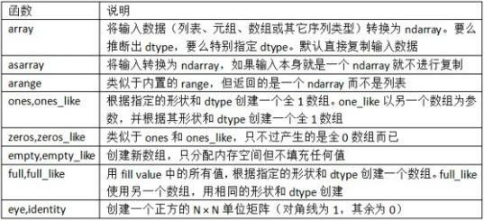
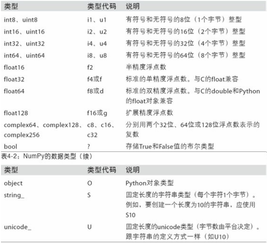

[toc]
NumPy的部分功能如下：
+ ndarray，一个具有矢量算数运算和复杂广播能力的快速且节省空间的多维数组
+ 用于对整组数据进行快速运算的标准数学函数（无需编写循环）
+ 用于读写瓷片数据的工具以及用于操作内存映射文件的工具
+ 线性代数、随机数生成以及傅里叶变换功能
+ 用于集成由C、C++、Fortran等语言编写的代码的A C API

对于大部分数据分析应用而言，功能主要集中在：
+ 用于数据整理和清理、子集构造和过滤、转换等快速的矢量化数组运算
+ 常用的数组算法，如排序、唯一化、集合运算等
+ 搞笑的描述统计和数据聚合/摘要运算
+ 用于异构数据集的合并/连接运算的数据对齐和关系型数据运算
+ 将条件逻辑表述为数组表达式（而不是带有if-elif-else分支的循环）
+ 数据的分组运算（聚合、转换、函数应用等）
  
NumPy可以高效处理大数组的数据，原因：
+ NumPy是在一个连续的内存块中存储数据，独立于其他Python内置对象。比起Python的内置序列，NumPy数组使用的内存更少
+ NumPy可以在整个数组上执行复杂的计算，而不需要Python的for循环
## 4.1 NumPy的ndarray：一种多维数组对象
ndarray是一个通用的同构数据多维容器，即其中所有的元素必须是相同的类型
+ 每个数组都有一个shape（一个表示各维度大小的元组）和一个dtype（一个用于说明数组数据类型的对象）
### 创建ndarray
+ zeros和ones分别可以创建指定长度或形状的全0或全1的数组
+ empty可以创建一个没有任何具体值的数组
**注意：认为np.empty会返回全0数组的想法是不安全的，很多情况下，返回的是一些未初始化的垃圾值**
arange是Python内置函数range的数组版
由于NumPy关注的是数值计算，因此如果没有特别指定，数据类型基本都是float64

#### ndarray的数据类型
dtype是一个特殊的对象，含有ndarray将一块内存解释为特定数据类型所需要的信息
NumPy所支持的全部数据类型

astype：明确的将一个数组从dtype转换成另一个dtype
+ 如果将浮点数转换成整数，则小数部分将会被截取删除
+ 如果某字符串数组表示的全是数字，也可以用astype将其转换为数值形式
+ 调用astype总会创建一个新的数组（一个数据的备份），即使新的dtype与旧dtype相同
#### NumPy数组的运算
矢量化：不用编写循环即可对数据执行批量运算
+ 大小相等的数组之间的任何算术运算都会将运算应用到元素级
+ 数组与标量的算术运算会将标量值传播到各个元素
+ 大小相同的数组之间的比较会生成布尔值数组
不同大小的数组之间的运算叫做广播
##### 基本的索引和切片
与列表最重要的区别在于：数组切片是原始数组的视图
+ 意味着数据不会被复制，视图上的任何修改都会张子杰反映到源数组上