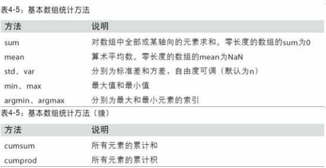
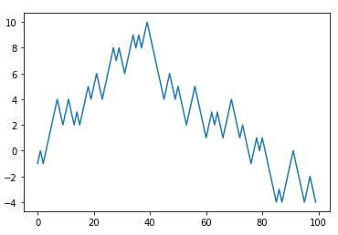

[toc]
NumPy的部分功能如下：
+ ndarray，一个具有矢量算数运算和复杂广播能力的快速且节省空间的多维数组
+ 用于对整组数据进行快速运算的标准数学函数（无需编写循环）
+ 用于读写瓷片数据的工具以及用于操作内存映射文件的工具
+ 线性代数、随机数生成以及傅里叶变换功能
+ 用于集成由C、C++、Fortran等语言编写的代码的A C API

对于大部分数据分析应用而言，功能主要集中在：
+ 用于数据整理和清理、子集构造和过滤、转换等快速的矢量化数组运算
+ 常用的数组算法，如排序、唯一化、集合运算等
+ 搞笑的描述统计和数据聚合/摘要运算
+ 用于异构数据集的合并/连接运算的数据对齐和关系型数据运算
+ 将条件逻辑表述为数组表达式（而不是带有if-elif-else分支的循环）
+ 数据的分组运算（聚合、转换、函数应用等）
  
NumPy可以高效处理大数组的数据，原因：
+ NumPy是在一个连续的内存块中存储数据，独立于其他Python内置对象。比起Python的内置序列，NumPy数组使用的内存更少
+ NumPy可以在整个数组上执行复杂的计算，而不需要Python的for循环
## 4.1 NumPy的ndarray：一种多维数组对象
ndarray是一个通用的同构数据多维容器，即其中所有的元素必须是相同的类型
+ 每个数组都有一个shape（一个表示各维度大小的元组）和一个dtype（一个用于说明数组数据类型的对象）
### 创建ndarray
+ zeros和ones分别可以创建指定长度或形状的全0或全1的数组
+ empty可以创建一个没有任何具体值的数组
**注意：认为np.empty会返回全0数组的想法是不安全的，很多情况下，返回的是一些未初始化的垃圾值**
arange是Python内置函数range的数组版
由于NumPy关注的是数值计算，因此如果没有特别指定，数据类型基本都是float64

#### ndarray的数据类型
dtype是一个特殊的对象，含有ndarray将一块内存解释为特定数据类型所需要的信息
NumPy所支持的全部数据类型

astype：明确的将一个数组从dtype转换成另一个dtype
+ 如果将浮点数转换成整数，则小数部分将会被截取删除
+ 如果某字符串数组表示的全是数字，也可以用astype将其转换为数值形式
+ 调用astype总会创建一个新的数组（一个数据的备份），即使新的dtype与旧dtype相同
#### NumPy数组的运算
矢量化：不用编写循环即可对数据执行批量运算
+ 大小相等的数组之间的任何算术运算都会将运算应用到元素级
+ 数组与标量的算术运算会将标量值传播到各个元素
+ 大小相同的数组之间的比较会生成布尔值数组
不同大小的数组之间的运算叫做广播
##### 基本的索引和切片
与列表最重要的区别在于：数组切片是原始数组的视图
+ 意味着数据不会被复制，视图上的任何修改都会张子杰反映到源数组上
**注意：如果想要得到ndarray切片的一份副本而非视图，需要明确的进行复制操作，如：`arr[5:8].copy()`**
arr2d[0][2]等价于arr2d[0, 2]
##### 切片索引
```python
arr2d = np.array([[1, 2, 3], [4, 5, 6], [7, 8, 9]])
arr2d[:2]
>>> array([[1, 2, 3],
       [4, 5, 6]])
arr2d[:2, 1:]
>>> array([[2, 3],
       [5, 6]])
```
**注意：只有冒号表示选取整个轴**
```python
arr2d[:, :1]
>>> array([[1],
       [4],
       [7]])
```
**对切片表达式的复制操作也会扩散到真个选区**
##### 布尔型索引
```python
names = np.array(['Bob', 'Joe', 'Will', 'Bob', 'Will', 'Joe', 'Joe'])
data = np.randow.randn(7, 4)
data
>>> array([[ 1.55909535,  1.02299823,  0.42394727, -0.57284079],
       [-0.64639878,  1.92593251, -0.19079343, -0.10489598],
       [-0.34718465, -1.81328708, -0.21964218, -0.10451726],
       [ 1.61382901, -0.65257385,  0.78272495, -0.2425886 ],
       [ 1.17610786,  1.29198075,  0.60518082,  0.60707813],
       [-1.21592097, -0.7345279 ,  1.02441371,  0.91295729],
       [ 0.25274477, -0.19095039, -1.13725406,  0.84783378]])
names
>>> array(['Bob', 'Joe', 'Will', 'Bob', 'Will', 'Joe', 'Joe'], dtype='<U4')
names == 'Bob'
>>> array([ True, False, False,  True, False, False, False])
data[names == 'Bob']
>>> array([[ 1.55909535,  1.02299823,  0.42394727, -0.57284079],
       [ 1.61382901, -0.65257385,  0.78272495, -0.2425886 ]])
# 布尔型数组的长度必须跟被索引的轴长度的一致
# 将布尔型数组跟切片、整数（或整数序列）混合使用
data[names=='Bob', 2:]
>>> array([[ 0.42394727, -0.57284079],
       [ 0.78272495, -0.2425886 ]])
data[names=='Bob', 3]
>>> array([-0.57284079, -0.2425886 ])
# data[names!='Bob']等价于data[~(names=='Bob')]
data[names!='Bob']
>>> array([[-0.64639878,  1.92593251, -0.19079343, -0.10489598],
       [-0.34718465, -1.81328708, -0.21964218, -0.10451726],
       [ 1.17610786,  1.29198075,  0.60518082,  0.60707813],
       [-1.21592097, -0.7345279 ,  1.02441371,  0.91295729],
       [ 0.25274477, -0.19095039, -1.13725406,  0.84783378]])
mask = (names=='Bob') | (names=='Will')
mask
>>> array([ True, False,  True,  True,  True, False, False])
data[mask]
>>> array([[ 1.55909535,  1.02299823,  0.42394727, -0.57284079],
       [-0.34718465, -1.81328708, -0.21964218, -0.10451726],
       [ 1.61382901, -0.65257385,  0.78272495, -0.2425886 ],
       [ 1.17610786,  1.29198075,  0.60518082,  0.60707813]])
# Python关键字and和or在布尔型数组中无效，需使用&和|
# 通过布尔型索引选取数组中的数据，将总是创建数据的副本
```
##### 花式索引
花式索引是NumPy的术语，指的是利用整数数组进行索引
```python
arr = np.empty((8, 4))
for i in range(8):
    arr[i] = i
arr
>>> array([[0., 0., 0., 0.],
       [1., 1., 1., 1.],
       [2., 2., 2., 2.],
       [3., 3., 3., 3.],
       [4., 4., 4., 4.],
       [5., 5., 5., 5.],
       [6., 6., 6., 6.],
       [7., 7., 7., 7.]])
arr[[4, 3, 0 ,6]]
>>> array([[4., 4., 4., 4.],
       [3., 3., 3., 3.],
       [0., 0., 0., 0.],
       [6., 6., 6., 6.]])
arr = np.arange(32).reshape((8, 4))
arr
>>> array([[ 0,  1,  2,  3],
       [ 4,  5,  6,  7],
       [ 8,  9, 10, 11],
       [12, 13, 14, 15],
       [16, 17, 18, 19],
       [20, 21, 22, 23],
       [24, 25, 26, 27],
       [28, 29, 30, 31]])
arr[[1, 5, 7, 2], [0, 3, 1, 2]]
>>> array([1., 5., 7., 2.])
# 无论数组是多少维的，花式索引总是一维的
arr[[1, 5, 7, 2]][:, [0, 3, 1, 2]]
>>> array([[ 4,  7,  5,  6],
       [20, 23, 21, 22],
       [28, 31, 29, 30],
       [ 8, 11,  9, 10]])
# 花式索引跟切片不一样，总是将数据复制到新数组中
```
##### 数组转置和轴对换
转置是重塑的一种特殊形式，返回的数据源的视图（不会进行任何复制操作）
```python
arr = np.arange(15).reshape((3, 5))
arr
>>> array([[ 0,  1,  2,  3,  4],
       [ 5,  6,  7,  8,  9],
       [10, 11, 12, 13, 14]])
arr.T
>>> array([[ 0,  5, 10],
       [ 1,  6, 11],
       [ 2,  7, 12],
       [ 3,  8, 13],
       [ 4,  9, 14]])
# 利用np.dot计算矩阵内积
arr = np.random.randn(6, 3)
arr
>>> array([[-2.06645763,  1.00539814,  0.67400769],
       [ 0.34550114, -0.91437003, -1.48596765],
       [ 1.67461979,  0.9884825 , -1.4609238 ],
       [-0.48805307, -0.77420188,  0.30222968],
       [ 1.01673065,  0.2198933 ,  1.66073492],
       [-0.25945991,  0.5167626 ,  1.1396863 ]])
np.dot(arr.T, arr)
>>> array([[ 8.53322606, -0.27085149, -3.10739068],
       [-0.27085149,  3.73878084,  1.3124177 ],
       [-3.10739068,  1.3124177 ,  8.94495267]])
# 对于高维数组，transpose需要得到一个由轴编号组成的元组才能对这些轴进行转置
arr = np.arange(16).reshape(2, 2, 4)
arr
>>> array([[[ 0,  1,  2,  3],
        [ 4,  5,  6,  7]],
       [[ 8,  9, 10, 11],
        [12, 13, 14, 15]]])
arr.transpose((1, 0, 2))
>>> array([[[ 0,  1,  2,  3],
        [ 8,  9, 10, 11]],
       [[ 4,  5,  6,  7],
        [12, 13, 14, 15]]])
arr.swapaxes(1, 2)
>>> array([[[ 0,  4],
        [ 1,  5],
        [ 2,  6],
        [ 3,  7]],
       [[ 8, 12],
        [ 9, 13],
        [10, 14],
        [11, 15]]])
```
## 4.2 通用函数：快速的元素级数组函数
通用函数是一种对ndarray中的数据执行元素级运算的函数


## 4.3 利用数组进行数据处理
用数组表达式代替循环的做法，称为矢量化
```python
# np.meshgrid接受两个一位数组，产生两个二维矩阵
points = np.arange(-5, 5, 0.01)
xs, ys = np.meshgrid(points, points)
```
### 将条件逻辑表述为数组运算
numpy.where函数是三元表达式`x if condition else y`的矢量化版本
```python
xarr = np.array([1.1, 1.2, 1.3, 1.4, 1.5])
yarr = np.array([2.1, 2.2, 2.3, 2.4, 2.5])
cond = np.array([True, False, False, True, False])
# 纯python
result = [(x if c else y) for x, y, c in zip(xarr, yarr, cond)]
result
>>> [1.1, 2.2, 1.3, 1.4, 2.5]
# numpy.where
result = np.where(cond, xarr, yarr)
result
>>> [1.1, 2.2, 1.3, 1.4, 2.5]
# 假设有一个随机数据组成的矩阵，希望将所有的正值替换为2， 所有负值替换为-2
arr = np.random.randn(4, 4)
arr
>>> 
array([[-0.94771367, -1.20358149, -0.39423309,  0.28986738],
       [ 0.89073046,  0.98328256, -0.17168639,  0.69513008],
       [ 0.80277368, -0.85871168, -1.21382631,  0.04325353],
       [-0.32688484, -0.68228237,  0.76567768,  0.67501496]])
arr > 0
>>> array([[False, False, False,  True],
       [ True,  True, False,  True],
       [ True, False, False,  True],
       [False, False,  True,  True]])
np.where(arr>0, 2, -2)
>>> array([[-2, -2, -2,  2],
       [ 2,  2, -2,  2],
       [ 2, -2, -2,  2],
       [-2, -2,  2,  2]])
```
### 数学和统计方法
sum、mean以及标准差std等聚合计算，通常叫做简约
既可以当做数组的实例方法调用，也可以当做顶级NumPy函数使用
+ sum求和
+ mean求平均值
mean和sum这类函数可以接受一个axis选项参数
+ axis=0，压缩行，对列求值
+ axis=1，压缩列，对行求值
累加函数（如cumsum、cumprod）类的函数则不聚合，而是产生一个由中间街而过组成的数组
多维数组中，累加函数返回的是同样大小的数组，但是会根据每个低维的切片沿着标记轴就散部分聚类
```python
arr = np.array([[1, 2, 3], [4, 5, 6], [7, 8, 9]])
# cumsum函数用来求矩阵或向量的累计和
arr.cumsum(axis=0)
>>> array([[ 1,  2,  3],
       [ 5,  7,  9],
       [12, 15, 18]], dtype=int32)
# cumprod函数用来求矩阵或向量的累计乘积
arr.cumprod(axis=1)
>>> array([[  1,   2,   6],
       [  4,  20, 120],
       [  7,  56, 504]], dtype=int32)
```

### 用于布尔型数组的方法
上面的这些方法中，布尔值会被强制转换为1（True）和0（False）
还有两个方法：any和all
+ any：数组中只要一个为True，则结果为True
+ all：数组中只要一个为False，则结果为False
### 排序
跟Python内置的列表类型一样，NumPy数组也可以通过sort方法就地排序
多维数组可以在任何一个轴上进行排序，只需将轴编号传给sort即可
```python
arr = np.random.randn(5, 3)
arr
>>> array([[ 1.71037987, -1.96620824,  1.04522764],
       [ 0.89555562,  0.29566309,  0.26463753],
       [ 1.56760425,  0.56420435,  1.26903646],
       [-0.50376587, -0.04976701, -0.07722982],
       [-0.7781307 , -0.63956118,  0.30063443]])
arr.sort(1)
>>> array([[-1.96620824,  1.04522764,  1.71037987],
       [ 0.26463753,  0.29566309,  0.89555562],
       [ 0.56420435,  1.26903646,  1.56760425],
       [-0.50376587, -0.07722982, -0.04976701],
       [-0.7781307 , -0.63956118,  0.30063443]])
arr.sort(0)
>>> array([[-1.96620824, -0.63956118, -0.04976701],
       [-0.7781307 , -0.07722982,  0.30063443],
       [-0.50376587,  0.29566309,  0.89555562],
       [ 0.26463753,  1.04522764,  1.56760425],
       [ 0.56420435,  1.26903646,  1.71037987]])
```
顶级方法np.sort返回的是数组的已排序**副本**，而就地排序则会**修改数组本身**
### 唯一化以及其它的集合逻辑

## 4.4 用于数组的文件输入输出
np.save和np.load是读写磁盘数组数据的两个主要函数
默认情况下，数组是以未压缩的原始二进制格式保存在扩展名为.npy的文件中的
```python
arr = np.arange(10)
np.save('some_array', arr)

np.load('some_array.npy')
arr
>>> array([0, 1, 2, 3, 4, 5, 6, 7, 8, 9])
```
+ 通过np.savez可以将多个数组保存到一个未压缩文件中，将数组以关键字参数的形式传入即可
+ 加载.npz文件时，会得到一个类似字典的对象，该对象会对各个数组进行延迟加载
+ 如果数据压缩的好，可以使用numpy.savez_compressed
## 4.5 线性代数
线性代数（如矩阵乘法、矩阵分解、行列式以及其他方阵数学等）是任何数据库的重要组成部分
NumPy提供了一个用于矩阵乘法的dot函数
+ 既是一个数组方法也是numpy命名空间中的一个函数
+ x.dot(y)等价于np.dot(x, y)
+ @符可以用作中缀运算符，进行矩阵乘法
    + x @ np.ones(3)
numpy.linalg中有一组标准的矩阵分解运算以及诸如求逆和行列式之类的东西
```python
from numpy.linalg import inv, qr
X = np.random.randn(5, 5)
>>> array([[-0.91347732, -0.29396599, -1.17840792, -1.07703131, -0.20065541],
       [ 2.10339103,  0.18677938, -0.20578942, -0.02775938, -0.7997946 ],
       [-0.69279281,  1.27247876,  0.22553877,  0.65522336,  0.51076041],
       [-2.02807103,  0.59529943, -0.58742588, -0.42387102, -0.2636186 ],
       [-0.19303962, -1.0522711 , -1.88932064, -0.1296265 ,  1.7990782 ]])
# 计算X和它的转置X.T的点积
mat = X.T.dot(X)
>>> array([[ 9.88899293, -1.22434231,  2.04339679,  1.3561844 , -1.66549388],
       [-1.22434231,  3.20216061,  2.23335114,  1.02925555, -1.4905175 ],
       [ 2.04339679,  2.23335114,  5.3964639 ,  1.91657191, -2.72793972],
       [ 1.3561844 ,  1.02925555,  1.91657191,  1.78655435,  0.45150819],
       [-1.66549388, -1.4905175 , -2.72793972,  0.45150819,  4.24698733]])
inv(mat)
>>> array([[ 0.73732704,  1.2764076 ,  1.20013728, -3.04547529,  1.83176453],
       [ 1.2764076 ,  2.76391248,  2.22969539, -5.84382853,  3.52403218],
       [ 1.20013728,  2.22969539,  3.180545  , -6.61843348,  3.99973721],
       [-3.04547529, -5.84382853, -6.61843348, 15.65348659, -9.16059105],
       [ 1.83176453,  3.52403218,  3.99973721, -9.16059105,  5.73360509]])
mat.dot(inv(mat))
>>>
```

## 4.6 伪随机数生成
numpy.random模块对Python内置的random进行了补充，增加了一些用于高效生成多种概率分布的样本值的函数
```python
samples = np.random.normal(size=(4,4))
sample
>>> array([[-0.4298104 , -0.28984895,  0.01340866,  0.4351447 ],
       [ 0.12683163, -0.60338482, -0.9701197 ,  0.40039294],
       [ 1.26852861,  0.05023312,  0.98346179, -0.48734415],
       [ 0.46960256, -0.82778916,  0.50028706, -0.08431316]])
```
Python内置的random模块只能**一次生成一个样本值**

## 4.7 示例：随机漫步
```python
# 纯Python实现
import random
import matplotlib.pyplot as plt
position = 0
walk = [position]
steps = 1000
for i in range(steps):
    step = 1 if random.randint(0, 1) else -1
    position += step
    walk.append(position)
plt.plot(walk[:100])
```

```python
nsteps = 1000
draws = np.random.randint(0, 2, size=nsteps)
steps = np.where(draws > 0, 1, -1)
walk = steps.cumsum()
plt.plot(walk[:100])
```

### 一次模拟多个随机漫步
```python
nwalks = 5000
nsteps = 5000
draws = np.random.randint(0, 2, size=(nwalks, nsteps))
steps = np.where(draws > 0, 1, -1)
walks = steps.cumsumm(1)
# 计算30或-30的最小穿越时间
hits30 = (np.abs(walks) >= 30).any(1)
```