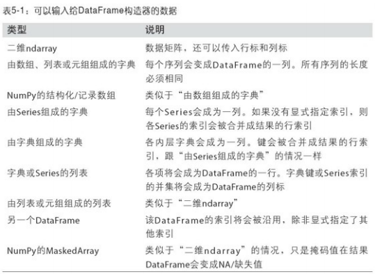
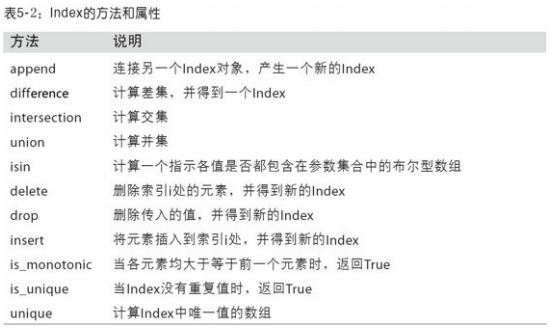
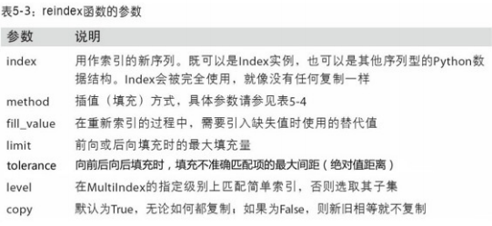

[toc]
pandas含有使数据清洗和分析工作变得更快更简单的数据结构和操作工具
pandas经常和其它工具一起使用
+ 数值计算工具NumPy和SciPy
+ 分析库statsmodels和scikit-learn
+ 数据可视化matplotlib
> pandas是基于NumPy数组构建的，特别是基于数组的函数和不使用for循环的数据处理
虽然pandas采用了大量的NumPy编码风格，但二者最大的不同是：
+ pandas是专门为处理表格和混杂数据设计的
+ NumPy更适合处理统一的数值数组数据
引入约定
> import pandas as pd
> from pandas import Series, DataFrame
## 5.1 pandas的数据结构介绍
pandas的主要数据结构：Series和DataFrame
### Series
Series是一种类似于一维数组的对象，它由一组数据（各种NumPy数据类型）以及一组与之相关的数据标签（即索引）组成
+ Series的字符串表现形式为：索引在左边，值在右边
+ 通过Series的values和index属性获取其数组表示形式和索引对象
+ 可以直接通过字典来创建Series
``` python
sdata = {'Ohio': 35000, 'Texas': 71000, 'Oregon': 16000, 'Utah': 5000}
obj3 = pd.Series(sdata)
>>> Ohio      35000
    Texas     71000
    Oregon    16000
    Utah       5000
    dtype: int64
states = ['California', 'Ohio', 'Oregon', 'Texas']
obj4 = pd.Series(sdata, index=states)
>>> California        NaN
    Ohio          35000.0
    Oregon        16000.0
    Texas         71000.0
    dtype: float64
pd.isnull(obj4)
>>> California     True
    Ohio          False
    Oregon        False
    Texas         False
    dtype: bool
pd.notnull(obj4)
>>> California    False
    Ohio           True
    Oregon         True
    Texas          True
    dtype: bool
```
### DataFrame
DataFrame是一个表个性的数据结构，含有一组有序的列，每列可以是不同的值类型（数值、字符串、布尔值等）
DataFrame既有行索引，也有列索引，可以被看作是Series组成的字典（共用同一个索引）
DataFrame中的数据是以一个或多个二维块存放的（而不是列表、字典或别的一维数据结构）
``` python
data = {'state': ['Ohio', 'Ohio', 'Ohio', 'Nevada', 'Nevada', 'Nevada'],
        'year': [2000, 2001, 2002, 2001, 2002, 2003],
        'pop': [1.5, 1.7, 3.6, 2.4, 2.9, 3.2]}
frame = pd.DataFrame(data)
>>> state	year	pop
0	Ohio	2000	1.5
1	Ohio	2001	1.7
2	Ohio	2002	3.6
3	Nevada	2001	2.4
4	Nevada	2002	2.9
5	Nevada	2003	3.2
# 对于特别大的DataFrame，head方法会选取前五行
# 指定列序列， DataFrame的列会按照指定顺序进行排列
pd.DataFrame(data, columns=['year', 'state', 'pop'])
>>> year	state	pop
0	2000	Ohio	1.5
1	2001	Ohio	1.7
2	2002	Ohio	3.6
3	2001	Nevada	2.4
4	2002	Nevada	2.9
5	2003	Nevada	3.2
# 如果传入的列在数据中找不到，就会在结果中产生缺失值
# 通过字典标记的方法或属性的方式，可以将DataFrame的列获取为一个Series
frame['state']
>>> 0      Ohio
    1      Ohio
    2      Ohio
    3    Nevada
    4    Nevada
    5    Nevada
    Name: state, dtype: object
frame.year
>>> 0    2000
    1    2001
    2    2002
    3    2001
    4    2002
    5    2003
    Name: year, dtype: int64
# frame[column]适用于任何列的名，frame。column只有在列名是一个合理的python变量名时才适用
# 行可以通过位置或名称的方式进行获取
frame.loc[0]
>>> state    Ohio
    year     2000
    pop       1.5
    Name: 0, dtype: object
# 如果赋值的是一个Series，就会精确匹配DataFrame的索引，所有的空位都会被填上缺失值
frame = pd.DataFrame(data, index=['one', 'two', 'three', 'four', 'five', 'six'])
val = pd.Series([-1.2, -1.5, -1.7], index = ['two', 'four', 'five'])
frame['debt'] = val
>>> 	    state	year	pop	debt
    one	    Ohio	2000	1.5	NaN
    two	    Ohio	2001	1.7	-1.2
    three	Ohio	2002	3.6	NaN
    four	Nevada	2001	2.4	-1.5
    five	Nevada	2002	2.9	-1.7
    six	    Nevada	2003	3.2	NaN
# 关键字del用于删除列
```
另一种常见的数据形式是嵌套字典
如果嵌套字典传给DataFrame，pandas会被解释为：外层字典的键作为列，内层键作为索引
```python
pop = {'Nevada': {2001: 2.4, 2002: 2.9},
        'Ohio': {2000: 1.5, 2001: 1.7, 2002: 3.6}}
frame = pd.DataFrame(pop)
>>> 	    Nevada	Ohio
    2001	2.4	    1.7
    2002	2.9	    3.6
    2000	NaN	    1.5
# 可使用类似NumPy数组的方法，对DataFrame进行转置（交换行和列）：frame.T
# 内层字典的键会被合并、排序以形成最终的索引。若明确指定了索引，则不会
```

### 索引对象
pandas的索引对象负责管理轴标签和其它元数据
index对象是不可变的，不可变可以使index对象在多个数据结构之间安全共享
与python的集合不同，pandas的Index是可以包含重复的标签

## 5.1 基本功能
### 重新索引
pandas对象的一个重要方法是reindex，其作用是创建一个新对象，他的数据符合新的索引
```python
obj = pd.Series([4.5, 7.2, -5.3, 3.6], index=['d', 'b', 'a', 'c'])
obj2 = obj.reindex(['a', 'b', 'c', 'd', 'e'])
>>> a   -5.3
    b    7.2
    c    3.6
    d    4.5
    e    NaN
    dtype: float64
# 不想以NaN填充， 使用fill_value方法设置
obj3 = obj.reindex(['a', 'b', 'c', 'd', 'e'], fill_value=0.0)
>>> a   -5.3
    b    7.2
    c    3.6
    d    4.5
    e    0.0
    dtype: float64
obj = pd.Series(['blue', 'purple', 'yellow'], index=[0, 2, 4])
>>> 0      blue
    2    purple
    4    yellow
    dtype: object
obj3 = obj.reindex(range(6), method='ffill')
obj
>>> 0      blue
    2    purple
    4    yellow
    dtype: object
obj3
>>> 0      blue
    1      blue
    2    purple
    3    purple
    4    yellow
    5    yellow
    dtype: object
# 借助DataFrame，reindex可以修改（行）索引和列，只传递一个序列时，会重新索引结果的行
fram = pd.DataFrame(np.arange(9).reshape((3, 3)), index = ['a', 'c', 'd'], columns=['Ohio', 'Texas', 'California'])
>>>     Ohio	Texas	California
    a	0	    1	    2
    c	3	    4	    5
    d	6	    7	    8
frame2 = frame.reindex(['a', 'b', 'c', 'd'])
>>>     Ohio	Texas	California
    a	0.0	    1.0	    2.0
    b	NaN	    NaN	    NaN
    c	3.0	    4.0	    5.0
    d	6.0	    7.0	    8.0
states = ['Texas', 'Utah', 'California']
frame.reindex(columns=states)
>>>     Texas	Utah	California
    a	1	    NaN	    2
    c	4	    NaN	    5
    d	7	    NaN	    8
```

### 丢弃指定轴上的项
丢弃某条轴上的一个或多个项很简单，只要有一个索引数组或列表即可。由于需要执行一些数据整理和集合逻辑，所以drop方法返回的是一个在**指定轴上删除了指定值的新对象**
```python
obj = pd.Series(np.arange(5.), index=['a', 'b', 'c', 'd', 'e'])
new_obj = obj.drop('c')
new_obj2 = obj.drop(['c', 'd'])
# 对于DataFrame，可以删除任意轴上的索引值
data = pd.DataFrame(np.arange(16).reshape((4, 4)), index=['Ohio', 'Colorado', 'Utah', 'New York'], columns=['one', 'two', 'three', 'four'])
data.drop(['Colorado', 'Ohio'])
>>>             one	two	three	four
        Utah	8	9	10	    11
    New York	12	13	14	    15
# 通过传递axis=1或axis='columns'可以删除列的值
data.drop('two', axis=1)
>>>         one	three	four
    Ohio	0	2	    3
Colorado	4	6	    7
    Utah	8	10	    11
New York	12	14	    15
data.drop(['two', 'four'], axis='columns')
>>>         one	three
    Ohio	0	2
Colorado	4	6
    Utah	8	10
New York	12	14
# 许多函数，如drop，会修改Series或DataFrame的大小或形状，可以就地修改对象，不会返回新的对象
obj
>>> d    4.5
    b    7.2
    a   -5.3
    c    3.6
    dtype: float64
obj.drop('c', inplace=True)
>>> d    4.5
    b    7.2
    a   -5.3
    dtype: float64
```
**小心使用inplace，它会销毁所有被删除的数据**